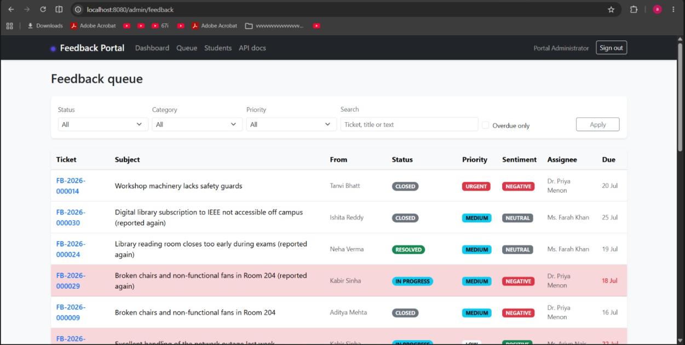
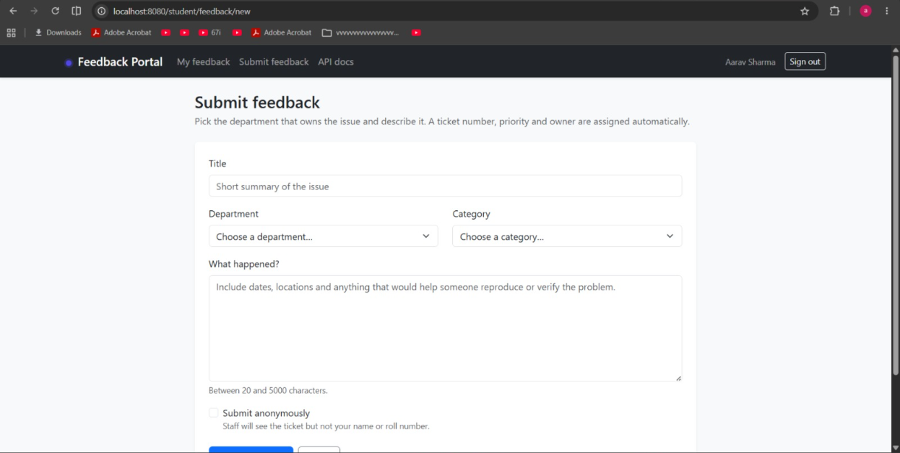
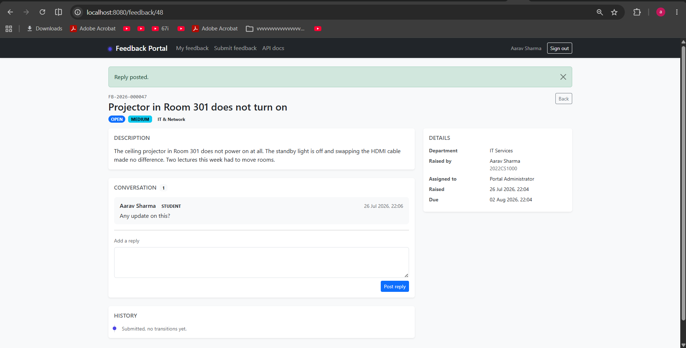

# Student Feedback Portal

A web app for handling student complaints at a college. Students raise a ticket, it gets routed to
the right department, staff work through a queue and resolve it against a deadline, and admins get
a dashboard showing where things are going wrong.

I built it as a personal project, mainly to get properly comfortable with Spring Boot and Docker.

[](https://github.com/adwitiyashukla/student-feedback-portal/actions/workflows/ci.yml)



*The staff queue. Overdue tickets are highlighted, and sentiment comes from the analytics service.*

## What it does

**Students** submit feedback against a department, anonymously if they want. They can track it by
ticket number, reply to staff, and rate the resolution once it's marked resolved.

**Department staff** get a queue filtered to their own department, with overdue tickets highlighted
in red. They can move a ticket through the workflow, reassign it to a colleague, and leave internal
notes the student never sees.

**Admins** get a dashboard with ticket volume over time, a category breakdown, average resolution
time and satisfaction score per department.

A small Python service also reads every new ticket and predicts its sentiment, category and
priority. These predictions are only suggestions, and staff can override them. If the service is
unavailable, the ticket is still saved, just without the extra labels.

| | |
|---|---|
|  |  |
| A student raising a ticket | The ticket, with the staff conversation and status history |

More screens in [`docs/screenshots/`](docs/screenshots).

## Running it

You only need Docker.

```bash
git clone https://github.com/adwitiyashukla/student-feedback-portal.git
cd student-feedback-portal

cp .env.example .env

# the app won't start without a signing key
echo "JWT_SECRET=$(openssl rand -base64 64 | tr -d '\n')" >> .env

docker compose up --build
```

First build takes a few minutes because Maven downloads everything and the Python model gets
trained during the image build.

On Windows I'd use the script instead, since it starts each service one at a time and doesn't
flatten a laptop:

```powershell
.\scripts\start-stack.ps1          # start
.\scripts\start-stack.ps1 -Down    # stop when you're done
```

Once it's up:

| | URL |
|---|---|
| App | http://localhost:8080 |
| API docs (Swagger) | http://localhost:8080/swagger-ui.html |
| Analytics service | http://localhost:8000/docs |
| Email catcher | http://localhost:8025 |

### Demo logins

The `docker` profile loads demo data: 10 departments, 24 students, 46 tickets with comment threads
and status history.

| Role | Email | Password |
|---|---|---|
| Department admin | `priya.menon@university.edu` | `Password#123` |
| Student | `aarav.sharma1@student.university.edu` | `Password#123` |
| Super admin | whatever you set in `.env` | your `BOOTSTRAP_ADMIN_PASSWORD` |

## How it's built

Spring Boot 3.3 on Java 21, serving both a REST API and a server-rendered Thymeleaf UI. MySQL with
Flyway migrations, Redis for caching and rate limiting, and a separate FastAPI service for the text
classification. All of it runs under Docker Compose.

Three interesting facts:

**Two security filter chains instead of one.** The API uses JWTs and is stateless, so CSRF tokens
do nothing for it. The UI uses a session cookie, so CSRF matters a lot. Trying to serve both from
one chain means a pile of if-statements, so there are two ordered chains instead.

**No endpoint takes an id saying whose data to load.** Scope comes from whoever is logged in.
A student passing someone else's ticket id gets a 404, not a 403, because a 403 would confirm the
ticket exists.

**Ticket status is a state machine.** Each status declares which statuses it can move to, and
anything else gets rejected with a 422. The status can't just be set to whatever the request says.

## Tests

```bash
cd backend           && mvn verify   # unit + integration tests, coverage gate
cd analytics-service && pytest       # 72 tests
```

The integration tests spin up a real MySQL 8.4 through Testcontainers rather than using H2, because
the schema uses full-text indexes and `TIMESTAMPDIFF` that H2 doesn't handle the same way.

CI runs both suites, builds both Docker images, and runs CodeQL and a dependency scan on every push.

## Docs

- [`docs/ARCHITECTURE.md`](docs/ARCHITECTURE.md) - design decisions and why
- [`docs/API.md`](docs/API.md) - endpoint reference with examples
- [`docs/RUNNING-LOCALLY.md`](docs/RUNNING-LOCALLY.md) - troubleshooting the Docker setup

## Licence

MIT, see [LICENSE](LICENSE).
